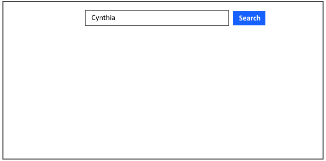
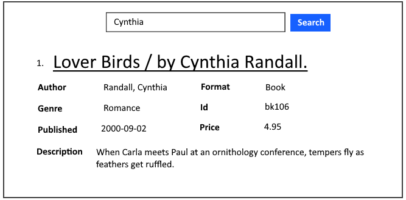

# LibraryCatalog

Making a change.

A GUI application to query into our library catalog

You will learn:
* How to parse XML files
* Python data structures (depending on your implementation)

Other skills:
* Experience with source control
* Understanding the GitHub workflow
* Planning/time-management
* Breaking down tasks into smaller, more manageable tasks

There might be more that I'm forgetting.

## Requirements
* Python 3
* TODO (MHarrison): any python libraries needed to run this program

## Input

Use *data/catalog.xml*

#### Custom (Optional)
If using custom file, make sure it follows this format:
```
<?xml version="1.0"?>
<catalog>
   <book id="id">
      <author>LastName, FirstName</author>
      <title>Book Title</title>
      <genre>Genre</genre>
      <price>0.00</price>
      <publish_date>year-month-day</publish_date>
      <description>Description of book.</description>
   </book>
   ...
</catalog>
```

## Run
The command format to run this application:
```
python3 library_catalog.py <xml-file>
```
For example:
```
python3 library_catalog.py catalog.xml
```

## GUI Example
Enter FirstName or LastName into the search bar as shown below:



The result should show information about the author's book as shown below:


